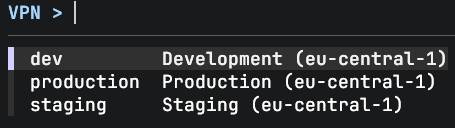

# aws-vpn-cli

A CLI companion for the [AWS VPN Client](https://aws.amazon.com/vpn/client-vpn/). Uses your existing profiles and the OpenVPN binary bundled with the app.



The AWS VPN Client works fine, but it's a GUI — which means leaving your terminal, clicking around, and switching back. This lets you stay in your terminal and script it. Combine it with `assume` or alias it into your workflow:

```bash
assume staging && vpn staging   # credentials + vpn in one go
```

## Highlights

- **Extends the AWS VPN Client** — reuses its profiles and bundled OpenVPN binary, nothing extra to install
- **Interactive picker** — fuzzy-search your profiles with fzf
- **One command** — `vpn` to connect, switch, or disconnect
- **SAML/SSO** — opens your browser, captures the callback, done

## Install

Requires macOS and [AWS VPN Client](https://aws.amazon.com/vpn/client-vpn/) with at least one profile configured.

```bash
brew install jlars22/tools/aws-vpn-cli
```

Then just run `vpn` — it will import your profiles on first launch.

## Usage

```console
$ vpn                   # interactive profile picker
$ vpn <profile>         # connect directly
$ vpn status            # show connection status
$ vpn disconnect        # disconnect
$ vpn list              # list available profiles
$ vpn import            # re-import profiles from AWS VPN Client
$ vpn logs              # tail the connection log
$ vpn setup-sudo        # skip password prompts (configures sudoers)
```

Tab completion is available for zsh — restart your shell after installing.

## How it works

SAML authentication is handled by a small Go server that captures the SSO callback from your browser. The tunnel runs on the OpenVPN binary bundled with the AWS VPN Client.

> [!NOTE]
> Homebrew's OpenVPN doesn't work with AWS Client VPN due to OpenSSL 3.6 TLS incompatibilities. That's why this uses the binary bundled with the AWS VPN Client, which is built against OpenSSL 3.0.

## Credits

Built on ideas from [aws-vpn-client](https://github.com/aws-vpn-client/aws-vpn-client).